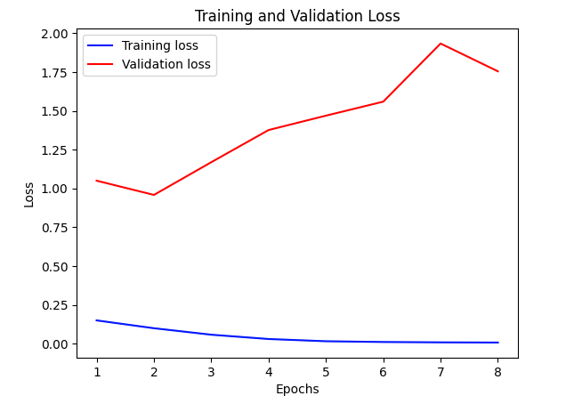

  
# Welcome to LogoRank 

  

  

**LogoRank** is a visionary startup. Our mission is to enhance language learning experiences and support learners in progressing at their own pace using innovative technology.

## The Idea Behind LogoRank

Reading materials that align with one's language proficiency is crucial in mastering a new language. However, finding texts that match a learner's level can be challenging. LogoRank aims to simplify this process by developing a tool that predicts the difficulty of French texts for English speakers, facilitating a more tailored learning experience.

### The Potential Impact

For learners, being presented with too-difficult texts can hinder learning, while too-easy texts may not offer enough challenges to facilitate growth. LogoRank addresses this by providing text recommendations that are just right for the user's current level. This approach enhances learning efficiency and boosts learner confidence and engagement.

### Our Goals

Our long-term goal is to integrate LogoRank into the daily learning routine of language learners worldwide, making it an indispensable tool in their language learning journey. Before testing our App, here is how we created an algorithm just for you!

## Application Development Process

Our journey in developing the application involved a meticulous process of testing various models, integrating sophisticated language models, and implementing data augmentation techniques to enhance performance and accuracy. Here's an overview of our development process:

### Initial Model Testing
We commenced our application development by evaluating a suite of fundamental machine learning models, including logistic regression, neural networks, and k-nearest neighbors (KNN). This initial phase aimed to establish a baseline understanding of model performance and to identify the strengths and limitations of each approach.

During this phase, we discovered that while these "basic" models provided reasonable performance on certain tasks, they often struggled to capture the nuanced complexities inherent in natural language processing tasks. Their performance was limited by factors such as feature engineering requirements, model capacity, and scalability issues, prompting us to explore more advanced methodologies.

--> Say why we used each model (inclusio-exclusion criteria): why we don't keep it. the motivation for the model.

Please find the link to the code below if you wish to execute it:

  

  

### Integration of Large Language Models
Recognizing the transformative potential of large language models, we transitioned to leveraging state-of-the-art architectures such as RoBERTa, Open AI etc. leveraging the powerful capabilities offered by these models to process and understand natural language data.

By integrating BERT and CamenBERT into our application pipeline, we observed substantial improvements in performance across various metrics, including accuracy, precision, and recall. The model demonstrated a remarkable ability to understand context, discern subtle nuances, and generate accurate predictions, thereby elevating the overall efficacy of our application.

### Data Size Augmentation with ChatGPT
In addition to leveraging advanced models, we employed data augmentation techniques to enhance the diversity and robustness of our training data. Leveraging the conversational abilities of ChatGPT, we generated synthetic data instances to supplement our existing dataset. This was achieved by giving ChatGPT our labeled dataset and asking it to generate similar sentences for each difficulty level. We added 50 lines to each difficulty level from A1 to C2, expanding the dataset from 4,800 to 5,100 lines.

We thought that this approach would enable us to create a more comprehensive and varied training dataset, encompassing a wider range of linguistic patterns, styles, and contexts. However, we realized that the accuracy scores diminished when utilizing this augmented dataset. Consequently, the new training set was not representative of the true distribution of text difficulty levels encountered by English speakers learning French.

**Reasons for the Decline in Accuracy:**
Firstly, the quality of the synthetic data could have led to this issues. Indeed, the synthetic sentences generated by ChatGPT may not have accurately reflected the nuances and subtleties inherent in genuine text difficulty levels. While ChatGPT can produce coherent and contextually relevant sentences, it may not perfectly emulate the complexity gradients needed for precise difficulty classification.

Secondly, introducing synthetic data can lead to a shift in the data distribution. If the generated sentences do not match the real-world complexity and difficulty levels, the model may learn to recognize patterns that are not truly indicative of each difficulty level. This can cause the model to perform poorly when evaluating real-world text data. Similarly, ChatGPT’s understanding of difficulty levels might not perfectly align with the linguistic features that determine text difficulty for language learners. The augmented sentences might not have the correct balance of vocabulary complexity, grammatical structures, and semantic content corresponding to each difficulty level.

Thirdly, the model might overfit to the augmented data, especially if the synthetic sentences have repetitive patterns or structures not found in the original dataset. Overfitting reduces the model’s ability to generalize to new, unseen data, leading to lower accuracy on the validation set.

Finally, although the dataset was expanded, the increase (from 4,800 to 5,100 lines) might have been insufficient to provide the diversity needed for significant performance improvement. A larger increase or more diverse augmentation techniques might have been necessary to see a positive impact.

To better understand the data, you can view and run the code cell in the following Jupyter Notebook on Colab:

### Data Generation and Augmentation through Coding
To enhance the robustness and diversity of our training data for LogoRank, we employed a technique called data augmentation. Specifically, we used synonym replacement, which involves replacing words in sentences with their synonyms to create new, varied versions of existing texts. This approach helps in mimicking the variability encountered in natural language, thereby improving the model's ability to generalize to new, unseen texts.

The initial dataset contained 4,800 sentences, and through synonym replacement, we expanded this to a total of 9,600 sentences. This was achieved by iterating over each sentence in the original dataset and replacing up to one word per sentence with one of its synonyms, using the NLTK library's WordNet resource. The augmented sentences retained the same difficulty labels as their originals, ensuring consistency in the learning targets. This method enabled us to increase our model's accuracy. 

### Reporting Table Initial Models

| Metric     | Logistic Regression | KNN    | Decision Tree | Random Forest | Neural Network | Neural Network (CNN) | XGBoost      | 
|------------|---------------------|--------|---------------|---------------|----------------|----------------------|--------------|
| Precision  | 0.4374              | 0.4003 | 0.2932        | 0.3706        | 0.4391         | 0.4735               | 0.4021       | 
| Recall     | 0.4427              | 0.3552 | 0.2938        | 0.3729        | 0.4375         | 0.4646               | 0.4094       |
| F1-score   | 0.4347              | 0.3303 | 0.2767        | 0.3649        | 0.4375         | 0.4614               | 0.4000       | 
| Accuracy   | 0.4427              | 0.3552 | 0.2938        | 0.3729        | 0.4375         | 0.4646               | 0.4094       |

### Reporting Table Large Language Models
 
| Metric       | RoBERTa      | OpenAI Embeddings   *model="text-embedding-3-large"*     | BERT (Multilingual)    *model= 'bert-base-multilingual-cased'* | CamemBERT   *low learning rate of 3e-5* |
|--------------|--------------|-------------------------|---------------------|--------------|
| Precision    | 0.5054       | 0.4706                  | 0.5533              | 0.6220       |
| Recall       | 0.4750       | 0.4813                  | 0.4958              | 0.6021       |
| F1-score     | 0.4729       | 0.4703                  | 0.4924              | 0.5995       |
| Accuracy     | 0.4750       | 0.4813                  | 0.4958              | 0.6021       |

### Conclusion
In summary, our application development process encompassed a comprehensive journey of exploration, experimentation, and innovation. By iteratively testing different models, integrating cutting-edge language technologies, and embracing novel data augmentation strategies, we were able to create a robust and effective application capable of delivering accurate and reliable predictions in real-world scenarios. Our commitment to continuous improvement and adaptation ensured that our application remained at the forefront of advancements in machine learning and natural language processing, poised to address evolving challenges and opportunities in the digital landscape.

## The Most accurate Model

For classifying the difficulty level of French texts, we utilized the CamembertForSequenceClassification model, a variant of the RoBERTa model pre-trained on French language texts. This choice was driven by Camembert's proven effectiveness in understanding and processing French text, making it ideally suited for our specific application in educational technology.

For this model we used the following parameters and configuration:

**Tokenizer:**
We used CamembertTokenizer to convert text data into a format suitable for model input. This involves encoding the texts into token ids, which are sequences of integers representing each token uniquely identifiable in the Camembert vocabulary.

**Sequence Length:** 
Each input sequence was truncated or padded to a maximum length of 128 tokens to maintain uniformity in input size.

**Label Encoding:** 
The difficulty labels ('A1', 'A2', 'B1', 'B2', 'C1', 'C2') were encoded using LabelEncoder from the scikit-learn library, converting them into numerical format for model training.

**Training Setup:** The model was trained on the NVIDIA CUDA-enabled GPU, which significantly accelerates the training process by enabling parallel processing over large batches of data.

**The Training Process**
The training was conducted over 5 epochs, with each epoch iterating through all the batches of the training data. We used a batch size of 16 for effective learning that balances speed and memory usage. The AdamW optimizer was employed with a learning rate of \(3 \times 10^{-5}\), which is a typical choice for fine-tuning models on smaller datasets. Additionally, a linear scheduler with warmup was used to adjust the learning rate dynamically during training, helping to stabilize the learning process in its early stages.

Loss and Backpropagation: In each training batch, the model computed the loss (error) between its predictions and the actual labels, using this loss to adjust the model weights through backpropagation. This is crucial for the model to learn from the training data effectively.
The confusion matrix shows ...

Here is a snipp of the code ...
confusion matrix

The model behaves by 

- show the graph with correlation Between lenght and difficulty 
- show the difdferent column
- 

## Challenges and Erronerous Predictions

During the development of our machine learning model, we encountered several significant challenges. 

### **1. Service Overload and Long Running Time**

A critical issue was the long running time on Google Colab, exacerbated by our dependency on external APIs for generating text embeddings. Particularly, we faced a 'ServiceUnavailableError' indicating that the OpenAI's server was temporarily overloaded or under maintenance (as shown in the error screenshot). 

The primary issue indicated by the error is that the server hosting the model (in this case, OpenAI's server for embeddings) was temporarily unavailable or overloaded. This can happen during periods of high demand or server maintenance. It reflected the dependency on third-party services and the need for robust error handling and retry mechanisms in our code.

Moreover, our large languge machine learning models, especially those involving extended datasets and complex computations, had long running times. This can be exacerbated when dependent on external services where network latency and server response times add to the overall execution time.

To address such challenges in future implementations, we had to start using Colab Pro and execute the code with better performing GPUs.

  

  

### **2. The Challenge of Overfitting**

While developing our machine learning model for sequence classification using the Camembert architecture, we encountered a significant challenge quite common in the field of artificial intelligence: overfitting. Overfitting occurs when a model learns the detail and noise in the training data to an extent that it negatively impacts the model's performance on new data, i.e., the model becomes too well-tuned to the training data and fails to generalise to unseen datasets.

In our specific case, the evidence of overfitting was clear from the divergence between the training and validation loss, as seen in our experiments. Initially, the training and validation losses decreased, indicating good learning progress. However, as training continued, the training loss kept decreasing. In contrast, the validation loss increased after the third epoch, suggesting that the model was beginning to fit excessively to the noise or specific details of the training dataset rather than capturing the underlying general patterns.

*when doing augmented data*

Several factors could have contributed to overfitting in our model:

**• Model Complexity:** The Camembert model is inherently complex and has many parameters. This complexity provides the model with high representational power. Still, it also makes it prone to overfitting, especially when the amount of data is insufficient to support learning such a number of parameters without memorising the data.

**• Insufficient Regularization:** Our initial model setup did not include sufficient mechanisms to penalise the model's complexity. Techniques like dropout, L2 regularisation (weight decay), or other constraints limiting the magnitude of the model parameters were not adequately implemented.

**• Inadequate Training Data:** Although we utilised augmented data, the diversity and volume might still be insufficient to train such a deep and complex model as Camembert. Deep learning models generally require large amounts of data to generalise well.

**• Training Duration and Learning Rate:** Prolonged training without adequate early stopping or adjustments to the learning rate can lead to the model fitting too closely to the training data. In our case, the training continued for several epochs even after the validation loss increased.

  

  

This graph represents the training and validation losses over eight epochs for a machine learning model, and it provides a clear visual indication of overfitting. Overfitting is evident when the model performs increasingly well on the training data, as shown by the decreasing blue line (training loss), but performs poorly on unseen validation data, indicated by the increasing red line (validation loss). The divergence of these two curves—where the training loss diminishes and the validation loss escalates—highlights that the model is memorizing the specific details and noise of the training data rather than learning to generalize from it. This is a classic sign of overfitting, where the model's learned parameters are too closely fitted to the idiosyncrasies of the training set and thus fail to predict new data accurately.

| Epoch | Training Loss         | Validation Loss       |
|-------|-----------------------|-----------------------|
| 1     | 0.15003619283632516   | 1.0499014826491475    |
| 2     | 0.09960768476031184   | 0.9583793990314007    |
| 3     | 0.0579031492045762    | 1.169020026922226     |
| 4     | 0.03017393670740795   | 1.376315168570727     |
| 5     | 0.015823067731603427  | 1.468769208760932     |
| 6     | 0.010979300375402883  | 1.5590531479101628    |
| 7     | 0.008641965876278631  | 1.9333672428037971    |
| 8     | 0.007510870984554583  | 1.754452733497601     |

Here is another example of a model, Camembert with data augmentation trained on the full dataset, that overfitted. Indeed, the rapid decrease in training loss compared to the relatively stagnant validation loss is a classic sign of overfitting. The model performs exceptionally well on the training data but struggles to replicate this performance on the validation data, indicating poor generalization. Using the full training set to train the model did not improve our results but instead just created overfitting.

  

  

**Strategies to Mitigate Overfitting**

To address overfitting, we plan to implement several strategies:

**•	Introduce Dropout**: Including dropout layers in the model can help by randomly disabling a fraction of the neurons during training, which can prevent them from co-adapting too much.

**•	Apply Early Stopping**: This involves monitoring the validation loss during training and stopping the training process once it degrades, even if the training loss continues to decrease.

**•	Enhance Regularization**: Implementing L2 regularisation can penalise large weights in the model, encouraging simpler models that may generalise better.

**•	Data Augmentation and Enrichment**: Increasing the size and diversity of the training dataset or employing sophisticated NLP-specific data augmentation techniques could enhance the model's generalisation ability.

**•	Adjust Learning Rate**: Refining the learning rate and possibly employing adaptive learning rate techniques such as learning rate schedules or reduction on plateau can significantly impact model training dynamics and outcomes.

By implementing these strategies, we aimed to develop a more robust model that performs well on training data and effectively generalises to new, unseen datasets.

### **3. Non-Representative augmented dataset**
Thirdly, Non-representative augmented dataset ...

.... 

### **4. Non-Accurate Model**

In our project, another significant challenge we faced was the issue of model inaccuracy, as evidenced by the low accuracy rate achieved by using an external language model, OpenAI's GPT-3.5 Turbo, to perform text classification.

  

  

We employed OpenAI's GPT-3.5 Turbo model, specifically the "gpt-3.5-turbo-instruct" configuration, to classify text according to a set difficulty scale from A1 to C2. This model is designed to understand and generate natural language or code based on the input provided to it, which makes it suitable for tasks that require a nuanced understanding of text.
Inherent Challenges:

**• Generalization Over Specialization:** GPT-3.5 Turbo is a highly generalized model designed to understand and generate natural language or code. While it excels in broad applications, it lacks the specialized training on educational data that specifically addresses the nuances of language learning and text difficulty assessment for French texts aimed at English speakers.

**• Prompt Sensitivity:** The efficacy of GPT-3.5's responses is highly dependent on the construction of the prompt. Subtle nuances in how prompts are phrased can lead to significant variances in the output, which may not always align with the specific educational standards used to define text difficulty levels.

**• Model Training and Data Representation:** GPT-3.5 Turbo has not been fine-tuned on a corpus specifically curated for grading French text difficulty, which likely contributed to the suboptimal accuracy observed (23.12%). The model's broad training base may not sufficiently capture the specific features relevant to the linguistic challenges faced by English speakers learning French

While GPT-3.5 Turbo offers a strong foundation due to its advanced natural language processing capabilities, its deployment in LogoRank highlighted the need for more specialized solutions in educational applications. Moving forward, by focusing on specialized training and enhanced model interaction strategies, LogoRank can better achieve its goal of seamlessly integrating into the language learning journey of individuals globally.

## Features of the LogoRank Application

- history of sentences
- learning difficuly bar
- recommendations
- partner d'autre site pour apprendre.
- sensitive analysis 

link to the video 

